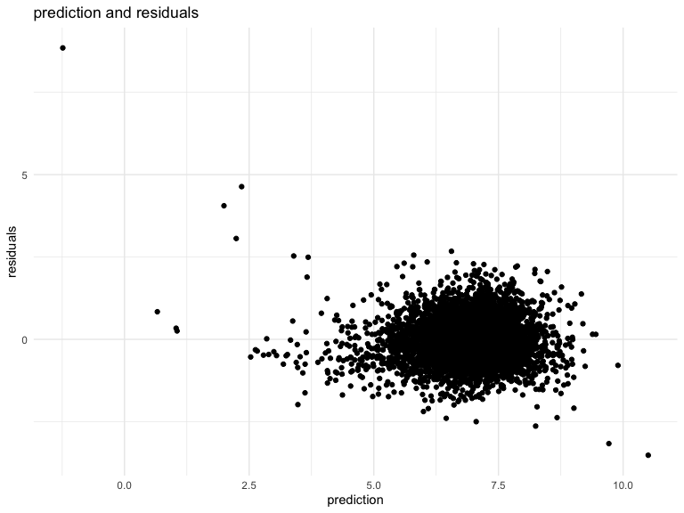

p8105\_hw6\_as5685
================

### Load in data

``` r
child_growth = read_csv("./data/birthweight.csv")
skimr::skim(child_growth)
```

    ## Skim summary statistics
    ##  n obs: 4342 
    ##  n variables: 20 
    ## 
    ## ── Variable type:numeric ────────────────────────────
    ##  variable missing complete    n      mean      sd     p0     p25     p50
    ##   babysex       0     4342 4342    1.49     0.5     1       1       1   
    ##     bhead       0     4342 4342   33.65     1.62   21      33      34   
    ##   blength       0     4342 4342   49.75     2.72   20      48      50   
    ##       bwt       0     4342 4342 3114.4    512.15  595    2807    3132.5 
    ##     delwt       0     4342 4342  145.57    22.21   86     131     143   
    ##   fincome       0     4342 4342   44.11    25.98    0      25      35   
    ##     frace       0     4342 4342    1.66     0.85    1       1       2   
    ##   gaweeks       0     4342 4342   39.43     3.15   17.7    38.3    39.9 
    ##   malform       0     4342 4342    0.0035   0.059   0       0       0   
    ##  menarche       0     4342 4342   12.51     1.48    0      12      12   
    ##   mheight       0     4342 4342   63.49     2.66   48      62      63   
    ##    momage       0     4342 4342   20.3      3.88   12      18      20   
    ##     mrace       0     4342 4342    1.63     0.77    1       1       2   
    ##    parity       0     4342 4342    0.0023   0.1     0       0       0   
    ##   pnumlbw       0     4342 4342    0        0       0       0       0   
    ##   pnumsga       0     4342 4342    0        0       0       0       0   
    ##     ppbmi       0     4342 4342   21.57     3.18   13.07   19.53   21.03
    ##      ppwt       0     4342 4342  123.49    20.16   70     110     120   
    ##    smoken       0     4342 4342    4.15     7.41    0       0       0   
    ##    wtgain       0     4342 4342   22.08    10.94  -46      15      22   
    ##      p75   p100     hist
    ##     2       2   ▇▁▁▁▁▁▁▇
    ##    35      41   ▁▁▁▁▅▇▁▁
    ##    51      63   ▁▁▁▁▁▇▁▁
    ##  3459    4791   ▁▁▁▃▇▇▂▁
    ##   157     334   ▁▇▅▁▁▁▁▁
    ##    65      96   ▁▂▇▂▂▂▁▃
    ##     2       8   ▇▇▁▁▁▁▁▁
    ##    41.1    51.3 ▁▁▁▁▃▇▁▁
    ##     0       1   ▇▁▁▁▁▁▁▁
    ##    13      19   ▁▁▁▁▂▇▁▁
    ##    65      77   ▁▁▁▅▇▂▁▁
    ##    22      44   ▂▇▅▂▁▁▁▁
    ##     2       4   ▇▁▇▁▁▁▁▁
    ##     0       6   ▇▁▁▁▁▁▁▁
    ##     0       0   ▁▁▁▇▁▁▁▁
    ##     0       0   ▁▁▁▇▁▁▁▁
    ##    22.91   46.1 ▁▇▅▁▁▁▁▁
    ##   134     287   ▁▇▆▁▁▁▁▁
    ##     5      60   ▇▁▁▁▁▁▁▁
    ##    28      89   ▁▁▁▇▇▁▁▁

  - no missing

### Tidy data

``` r
child_growth_clean = 
child_growth %>% 
  mutate(
    babysex = recode_factor(babysex, `1` = "male", `2` = "female"),
    frace = recode_factor(frace, `1` = "White", `2` = "Black", `3` = "Asian", `4` = "Puerto Rican", `8` = "Other", `9` = "Unknown"),
    mrace = recode_factor(mrace, `1` = "White", `2` = "Black", `3` = "Asian", `4` = "Puerto Rican", `8` = "Other"),
    malform = recode_factor(malform, `0` = "absent", `1` = "present"),
    bwt = bwt * 0.0022
  )
```

  - There is no missing data in the dataset. Categorical variables were
    transfered to factor from numeric.

### Building My own model

``` r
child_growth_clean = 
  child_growth_clean %>% 
  mutate(
    babysex = fct_infreq(babysex)
  )
mymodel = lm(bwt ~ babysex+blength + delwt + fincome + gaweeks, data = child_growth_clean)

mymodel %>% 
  broom::glance() %>% view

mymodel %>% 
  broom::tidy() %>% 
  select(term, estimate, p.value) %>% 
  knitr::kable(digits = 3)
```

| term          | estimate | p.value |
| :------------ | -------: | ------: |
| (Intercept)   |  \-9.763 |   0.000 |
| babysexfemale |  \-0.039 |   0.076 |
| blength       |    0.270 |   0.000 |
| delwt         |    0.006 |   0.000 |
| fincome       |    0.004 |   0.000 |
| gaweeks       |    0.055 |   0.000 |

``` r
plots = 
child_growth_clean %>% 
  modelr::add_residuals(mymodel) %>% 
  modelr::add_predictions(mymodel) %>% 
  ggplot(aes(x = pred, y =  resid)) + geom_point() + 
  labs(
    x = "prediction",
    y = "residuals",
    title =  "prediction and residuals"
  )
plots
```



  - I chose the potential factors that underly birthweight: `babysex`,
    `blength`, `delwt`, `fincome`, `gaweeks`. baby sex and baby’s length
    will direcly influence the weight of newborns. family income will
    affect the mother’s health condition, thereby cause the difference
    on newborns’ weights. Also, less gastational age will lead to higher
    possibilities to lighter babies.

### Comparison

``` r
cv_df = 
  crossv_mc(child_growth_clean, 100)

cv_df =
  cv_df %>% 
  mutate(
    train = map(train, as_tibble),
    test = map(test, as_tibble)
  )

cv_df = 
  cv_df %>% 
  mutate(
    mymodel = map(train, ~lm(bwt ~ babysex + blength + delwt + fincome + gaweeks, data = .x)),
    maineffect = map(train, ~lm(bwt ~ blength + gaweeks, data = .x)),
    threewayinteraction = map(train,~lm(bwt ~ bhead * blength * babysex, data = .x))
  ) %>% 
  mutate(
    rmse_mymodel = map2_dbl(mymodel, test, ~rmse(model = .x, data = .y)),
    rmse_maineffect = map2_dbl(maineffect, test, ~rmse(model = .x, data = .y)),
    rmse_threewayinteraction = map2_dbl(threewayinteraction, test, ~rmse(model = .x, data = .y))
    )

comparison_plot =
cv_df %>% 
  select(starts_with("rmse")) %>% 
  pivot_longer(
    everything(),
    names_to = "model",
    values_to = "rmse", 
    names_prefix = "rmse_"
  ) %>% 
  ggplot(aes(x = model, y = rmse)) + geom_violin() +
  labs(
    title = "model comparison"
  )

comparison_plot
```


## Question 2

### load in data

``` r
weather_df = 
  rnoaa::meteo_pull_monitors(
    c("USW00094728"),
    var = c("PRCP", "TMIN", "TMAX"), 
    date_min = "2017-01-01",
    date_max = "2017-12-31") %>%
  mutate(
    name = recode(id, USW00094728 = "CentralPark_NY"),
    tmin = tmin / 10,
    tmax = tmax / 10) %>%
  select(name, id, everything())
```

## clean

``` r
weather_df_clean =
weather_df %>% 
  select(tmax, tmin)
```

## drawing the plot

``` r
r_df =
  weather_df_clean %>% 
  modelr::bootstrap(5000) %>% 
  mutate(
    models = map(strap, ~lm(tmax ~ tmin , data = .x)),
    results = map(models, broom::glance)) %>% 
  unnest(results)

plot_r = 
  r_df %>%   
  ggplot(aes(x = r.squared)) + geom_density() + 
  labs(
    title = "Distribution of r.squared"
  )

plot_r
```


``` r
log_df =
  weather_df_clean %>% 
  modelr::bootstrap(5000) %>% 
  mutate(
    models = map(strap, ~lm(tmax ~ tmin , data = .x)),
    results = map(models, broom::tidy)) %>% 
  unnest(results) %>% 
  select(.id, estimate, term) %>% 
  pivot_wider(
  names_from = "term",
  values_from = "estimate"
    ) %>% 
  mutate(
    log = log(`(Intercept)`*tmin)
  ) 

plot_log = 
   log_df %>% 
    ggplot(aes(x = log)) + geom_density() +
    labs(
      title = "Distribution of log(intercept*beta1)"
    )
plot_log
```


``` r
quantile(log_df$log, probs = c(0.025, 0.975))
```

    ##     2.5%    97.5% 
    ## 1.965633 2.058469

``` r
quantile(r_df$r.squared, probs = c(0.025, 0.975))
```

    ##      2.5%     97.5% 
    ## 0.8936977 0.9274807

  - Two plots mostly have normal distribution. The 95% CI for
    log(intercept\*beta1) is 1.9656328, 2.0584694. The 95% CI for
    r.squared is 0.8936977, 0.9274807.
